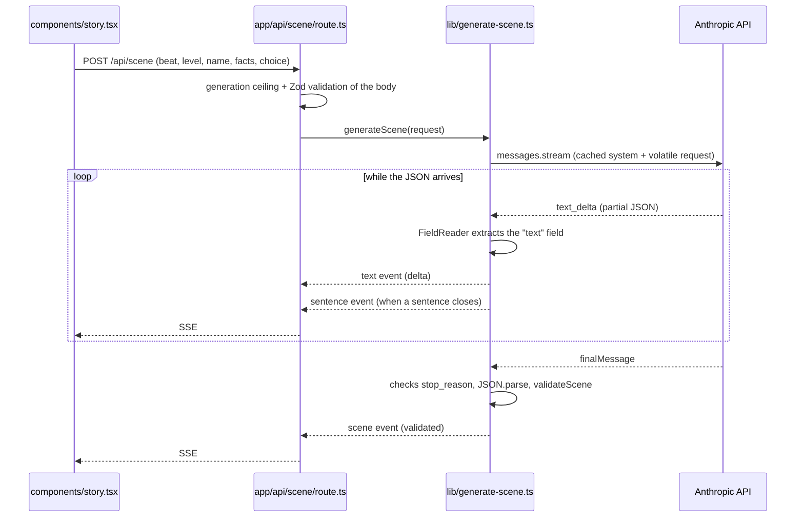

# Architecture

Next.js 15 (App Router) + React 19, TypeScript, Tailwind 4. One real endpoint:
`POST /api/scene`, which returns SSE.

## A scene's journey



The client does not use `EventSource` — it cannot POST. The minimal SSE reader is
in [lib/sse.ts](../lib/sse.ts).

## The central conflict: structured output versus streaming

The model returns JSON validated by a schema, but what arrives on the wire is
JSON, not prose. Waiting for the JSON to close before showing anything throws away
exactly the latency streaming exists to win.

[lib/stream-json.ts](../lib/stream-json.ts) solves it with two pieces:

| Class | What it does |
| --- | --- |
| `FieldReader` | Extracts **one** string field from a JSON that is still arriving, decoding escapes (`\n`, `\uXXXX`) and never emitting half an escape sequence. |
| `Sentences` | Accumulates text and returns each complete sentence exactly once. End of sentence = final punctuation followed by a space. `drain()` at the end picks up the last one, which has no space after it. |

This is why **`text` is the first field** of `sceneSchema` in
[lib/schema.ts](../lib/schema.ts): the reader needs it to arrive before `world`,
`new_facts` and `choices`. It is also why an invented world is declared *after*
the prose rather than before it — a world block in front of the text would push
the first token back by its own length, and nothing delays the first token.

## The three layers of the story bible

| Layer | Scope | Where it lives | In the prompt |
| --- | --- | --- | --- |
| 1. Constitution | Every story, forever | [lib/prompts/v1.ts](../lib/prompts/v1.ts) | `system`, in full, **cached** |
| 2. World | One world | [lib/story-bibles/](../lib/story-bibles/) | `system`, in full, **cached** |
| 2. World, when invented | One run | `stories.world`, written by beat 1 | user message, outside the cache |
| 3. Established facts | One path in the graph | `scenes.new_facts` column | user message, accumulated, outside the cache |

Layer 2 comes in two forms and nothing below it can tell them apart. A **fixed
world** is a file someone wrote; an **invented world** is written by the model on
beat 1 and returned in `scene.world`. What sits in the cached `system` for an
invented run is the *charter* — the shape a world must have, identical for every
child — while the world itself is volatile and rides in the user message with the
facts. [lib/story-bibles/index.ts](../lib/story-bibles/index.ts) is the registry;
`bible.invented` is the fork, and the generator reads it once.

Layer 3 is what stops the dragon that was blue in scene 2 from being green in
scene 4. Every scene returns, in `new_facts`, the facts it made true; the whole
path comes back on the next call, inside `buildRequest`.

Climbing `parent_scene_id` gives exactly the facts of that branch. **Different
branches hold different truths without contaminating each other** — that property
is what makes the graph worth more than a list.

The split between layers is not organisational, it is about the cache: everything
identical across every call of the story goes in the `system` with `cache_control`
on the last block; everything that varies per scene (beat, level, facts, choice
made) goes in the user message, after the breakpoint. See
[decisions.md](decisions.md#the-cache-is-in-the-right-place).

## The shape of a story

Five beats, defined per bible in `bible.beats[beat]`. Beat 5 closes and returns
`choices: []` — it is the end-of-story signal for the UI, and `validateScene`
rejects any other combination:

```
beat 1 ──┬── choice A ── beat 2 ──┬── choice A ── beat 3 ── …
         │                        └── choice B ── beat 3 ── …
         └── choice B ── beat 2 ── …
```

Taking another path **overwrites nothing**: it creates a new scene, child of the
same parent. The archive grows and you can go back and see the other path.

## The graph in the database

[supabase/schema.sql](../supabase/schema.sql) — `profiles` → `stories` → `scenes`,
with `scenes.parent_scene_id` pointing at the parent.

- `scene_path(uuid)` is a recursive CTE that climbs to the root. It is what
  assembles the little book to re-read and the set of facts of that branch.
- The unique index `scenes_parent_choice` on `(parent_scene_id, entry_choice)`
  guarantees a parent cannot have two scenes for the same choice: **reuse, don't
  regenerate.**
- RLS enabled on all three tables. Each guardian only reaches what is theirs; no
  child's data crosses accounts.

**This schema is not used by the app yet.** Today the client keeps the path in
memory (`useState` in [components/story.tsx](../components/story.tsx)) and sends
the accumulated facts in the POST body. Reloading the page loses the path. See
[roadmap.md](roadmap.md).

## Server limits and defences

Everything that protects cost or content lives on the server, because the front
end is inspectable by any 8-year-old with a curious finger.

| Where | Defence |
| --- | --- |
| [app/api/scene/route.ts](../app/api/scene/route.ts) | Ceiling of 60 generations per hour, per `x-forwarded-for`, in a `Map` in the process memory. |
| [app/api/scene/route.ts](../app/api/scene/route.ts) | `z.strictObject` on the body: an extra field is a 400, not an ignored field. |
| [lib/scene-route.ts](../lib/scene-route.ts) | The seed is an id from a closed list, resolved server-side: a child's own prose never reaches the prompt. An unknown `bible_id` is a 400. |
| [lib/scene-route.ts](../lib/scene-route.ts) | The world round-trips through the browser, so it is re-validated on the way back in — same caps as the output schema. |
| [lib/schema.ts](../lib/schema.ts) | `validateScene` checks the schema **and** the choice-count rule per beat. |
| [lib/generate-scene.ts](../lib/generate-scene.ts) | `stop_reason` `refusal` and `max_tokens` become explicit errors, not a half-baked scene. |
| [lib/generate-scene.ts](../lib/generate-scene.ts) | Error detail only in the server log; the client gets a code (`generation-failed`). |
| [lib/anthropic.ts](../lib/anthropic.ts) | The client only exists in server code. The key never reaches the browser. |

The ceiling in a `Map` in process memory works with a single instance. With more
than one, each counts its own — it needs to move to Redis or Supabase (there is a
`TODO` in the code).

## Model configuration

In [lib/anthropic.ts](../lib/anthropic.ts):

- `MODEL = "claude-opus-5"`
- `MAX_TOKENS = 4000` — a scene in `ler` mode lands around ~350 tokens; the rest is
  headroom for thinking. Since it is streaming, being generous here costs no
  timeout.
- `EFFORT = "low"` — a short scene with a rigid format comes out well, and the
  first token arrives fast, which is what matters. Raise to `medium` if the
  evaluation shows unbalanced choices.

## File map

| Path | What it is |
| --- | --- |
| [docs/story-bible.md](story-bible.md) | Source of truth, in prose, in pt-BR. **Change here first**, code after. |
| [lib/prompts/v1.ts](../lib/prompts/v1.ts) | Layer 1 + reading-level rules + `buildRequest`. Versioned. |
| [lib/story-bibles/](../lib/story-bibles/) | Layer 2: one file per world, named after its `bible_id`. |
| [lib/story-bibles/index.ts](../lib/story-bibles/index.ts) | The registry. Adding a world is adding a file and an entry — the generator never imports one directly. |
| [lib/story-bibles/original.ts](../lib/story-bibles/original.ts) | The world charter and the seed list: layer 2 for a story nobody wrote. |
| [lib/schema.ts](../lib/schema.ts) | Output contract (Zod) + the rule the schema cannot express. |
| [lib/types.ts](../lib/types.ts) | `Beat`, `Scene`, `SceneRequest`, `ReadingLevel`. |
| [lib/stream-json.ts](../lib/stream-json.ts) | Extracts the text from the partial JSON and splits it into sentences. |
| [lib/generate-scene.ts](../lib/generate-scene.ts) | The call to the model, with cache and streaming. |
| [lib/sse.ts](../lib/sse.ts) | The client's SSE reader. |
| [lib/audio.ts](../lib/audio.ts) | iOS unlock for both `speechSynthesis` and the `AudioContext`, on the one user gesture. |
| [lib/tts/voices.ts](../lib/tts/voices.ts) | The voice catalogue: a voice is a character, and its id outlives any provider. |
| [lib/tts/queue.ts](../lib/tts/queue.ts) | Speaks sentences in order as they arrive, and goes silent on demand. |
| [lib/tts/speaker.ts](../lib/tts/speaker.ts) | The device voice, over `speechSynthesis`. |
| [app/api/scene/route.ts](../app/api/scene/route.ts) | SSE route + generation ceiling. |
| [components/story.tsx](../components/story.tsx) | All the UI and the path state. |
| [supabase/schema.sql](../supabase/schema.sql) | The scene graph, with RLS. |
