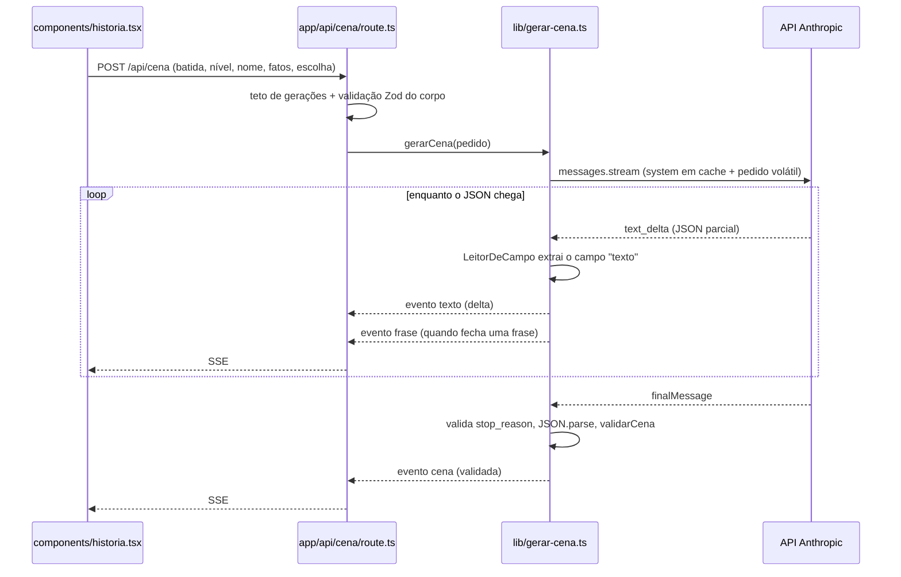

# Arquitetura

Next.js 15 (App Router) + React 19, TypeScript, Tailwind 4. Um único endpoint de
verdade: `POST /api/cena`, que devolve SSE.

## O percurso de uma cena



O cliente não usa `EventSource` — ela não faz POST. O leitor de SSE mínimo está
em [lib/sse.ts](../lib/sse.ts).

## O atrito central: saída estruturada versus streaming

O modelo devolve JSON validado por schema, mas o que chega no fio é JSON, não
prosa. Esperar o JSON fechar para mostrar algo joga fora exatamente a latência
que o streaming existe para ganhar.

[lib/stream-json.ts](../lib/stream-json.ts) resolve isso com duas peças:

| Classe | O que faz |
| --- | --- |
| `LeitorDeCampo` | Extrai **um** campo string de um JSON que ainda está chegando, decodificando escapes (`\n`, `\uXXXX`) e sem nunca emitir meia sequência de escape. |
| `Frases` | Acumula texto e devolve cada frase completa uma única vez. Fim de frase = pontuação final seguida de espaço. `drenar()` no fim pega a última, que não tem espaço depois. |

É por isso que **`texto` é o primeiro campo** de `cenaSchema` em
[lib/schema.ts](../lib/schema.ts): o leitor precisa que ele chegue antes de
`fatos_novos` e `escolhas`.

## As três camadas do story bible

| Camada | Escopo | Onde vive | No prompt |
| --- | --- | --- | --- |
| 1. Constituição | Todas as histórias, para sempre | [lib/prompts/v1.ts](../lib/prompts/v1.ts) | `system`, íntegra, **em cache** |
| 2. Bíblia da história | Um mundo | [lib/story-bibles/](../lib/story-bibles/) | `system`, íntegra, **em cache** |
| 3. Fatos estabelecidos | Um caminho no grafo | coluna `cenas.fatos_novos` | mensagem do usuário, acumulada, fora do cache |

A camada 3 é o que evita o dragão que era azul na cena 2 virar verde na cena 4.
Cada cena devolve em `fatos_novos` os fatos que ela tornou verdade; o caminho
inteiro volta na chamada seguinte, dentro de `montarPedido`.

Subir por `cena_pai_id` dá exatamente os fatos daquele ramo. **Ramos diferentes
têm verdades diferentes sem se contaminar** — é essa propriedade que faz o grafo
valer mais que uma lista.

O corte entre camadas não é organizacional, é de cache: tudo que é idêntico em
toda chamada da história fica no `system` com `cache_control` no último bloco;
tudo que varia por cena (batida, nível, fatos, escolha feita) fica na mensagem do
usuário, depois do breakpoint. Ver
[decisoes.md](decisoes.md#o-cache-está-no-lugar-certo).

## Estrutura de uma história

Cinco batidas, definidas por bíblia em `biblia.batidas[batida]`. A batida 5
encerra e devolve `escolhas: []` — é o sinal de fim de história para a UI, e
`validarCena` rejeita qualquer outra combinação:

```
batida 1 ──┬── escolha A ── batida 2 ──┬── escolha A ── batida 3 ── …
           │                           └── escolha B ── batida 3 ── …
           └── escolha B ── batida 2 ── …
```

Escolher outro caminho **não sobrescreve nada**: cria uma cena nova, filha do
mesmo pai. O acervo cresce e dá para voltar e ver o outro caminho.

## O grafo no banco

[supabase/schema.sql](../supabase/schema.sql) — `perfis` → `historias` → `cenas`,
com `cenas.cena_pai_id` apontando para o pai.

- `caminho_da_cena(uuid)` é um CTE recursivo que sobe até a raiz. É o que monta o
  livrinho para reler e o conjunto de fatos daquele ramo.
- O índice único `cenas_pai_escolha` em `(cena_pai_id, escolha_entrada)` garante
  que um pai não tenha duas cenas para a mesma escolha: **reuse, não regere.**
- RLS ligada nas três tabelas. Cada responsável só alcança o que é dele; nenhum
  dado de criança cruza contas.

**Este schema ainda não é usado pelo app.** Hoje o cliente guarda o caminho em
memória (`useState` em [components/historia.tsx](../components/historia.tsx)) e
manda os fatos acumulados no corpo do POST. Recarregar a página perde o caminho.
Ver [roadmap.md](roadmap.md).

## Limites e defesas do servidor

Tudo que protege custo ou conteúdo vive no servidor, porque o front é
inspecionável por qualquer criança de 8 anos com o dedo curioso.

| Onde | Defesa |
| --- | --- |
| [app/api/cena/route.ts](../app/api/cena/route.ts) | Teto de 60 gerações por hora, por `x-forwarded-for`, em `Map` na memória do processo. |
| [app/api/cena/route.ts](../app/api/cena/route.ts) | `z.strictObject` no corpo: campo a mais é 400, não campo ignorado. |
| [lib/schema.ts](../lib/schema.ts) | `validarCena` checa o schema **e** a regra de contagem de escolhas por batida. |
| [lib/gerar-cena.ts](../lib/gerar-cena.ts) | `stop_reason` `refusal` e `max_tokens` viram erro explícito, não cena meia-boca. |
| [lib/gerar-cena.ts](../lib/gerar-cena.ts) | Detalhe do erro só no log do servidor; para o cliente vai um código (`falha-na-geracao`). |
| [lib/anthropic.ts](../lib/anthropic.ts) | Cliente só existe em código de servidor. A chave nunca chega ao browser. |

O teto em `Map` na memória do processo funciona em uma instância só. Com mais de
uma, cada uma conta o seu — precisa ir para Redis ou Supabase (há um `TODO` no
código).

## Configuração do modelo

Em [lib/anthropic.ts](../lib/anthropic.ts):

- `MODELO = "claude-opus-5"`
- `MAX_TOKENS = 4000` — uma cena no modo `ler` fica em ~350 tokens; o resto é
  folga para o thinking. Como é streaming, ser generoso aqui não custa timeout.
- `EFFORT = "low"` — cena curta com formato rígido sai bem, e o primeiro token
  chega rápido, que é o que importa. Subir para `medium` se a avaliação mostrar
  escolhas desequilibradas.

## Mapa dos arquivos

| Caminho | O que é |
| --- | --- |
| [docs/story-bible.md](story-bible.md) | Fonte de verdade em prosa. **Altere aqui primeiro**, código depois. |
| [lib/prompts/v1.ts](../lib/prompts/v1.ts) | Camada 1 + regras de nível de leitura + `montarPedido`. Versionado. |
| [lib/story-bibles/](../lib/story-bibles/) | Camada 2: um arquivo por mundo. |
| [lib/schema.ts](../lib/schema.ts) | Contrato de saída (Zod) + a regra que o schema não expressa. |
| [lib/tipos.ts](../lib/tipos.ts) | `Batida`, `Cena`, `PedidoDeCena`, `NivelLeitura`. |
| [lib/stream-json.ts](../lib/stream-json.ts) | Extrai o texto do JSON parcial e quebra em frases. |
| [lib/gerar-cena.ts](../lib/gerar-cena.ts) | A chamada ao modelo, com cache e streaming. |
| [lib/sse.ts](../lib/sse.ts) | Leitor de SSE do cliente. |
| [lib/audio.ts](../lib/audio.ts) | Desbloqueio do `AudioContext` no iOS. Sem narração ainda. |
| [app/api/cena/route.ts](../app/api/cena/route.ts) | Rota SSE + teto de gerações. |
| [components/historia.tsx](../components/historia.tsx) | Toda a UI e o estado do caminho. |
| [supabase/schema.sql](../supabase/schema.sql) | O grafo de cenas, com RLS. |
